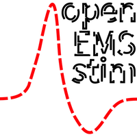

#### Navigating the openEMSstim repository:

* [This page = official](https://github.com/PedroLopes/openEMSstim/): your starting point to the official & maintained code.
* [UIST 2016](https://github.com/PedroLopes/openEMSstim/tree/UIST2016): a sub branch containing the student projects from ACM UIST 2016 SIC. 
* [simple-multiplexer](https://github.com/PedroLopes/openEMSstim/tree/simple-multiplexer): a sub branch that offers a simple multiplexer from 2 to 5 channels using relays.

# openEMSstim: open-hardware module to adjust the intensity of EMS/TENS stimulators. 

This is the openEMSstim, a **hardware board** based on an Arduino Nano that modulates the amplitude of Electrical Muscle Stimulation (EMS) signals. Here you also find the **software** that communicates with the board and controls it (android, unity, etc). This board is controllable via *Bluetooth* and compatible with any *BLE* device you have (such as your smartphone). It also is controllable via *Serial* (USB) by plugging in a USB cable from your computer to the *Arduino Nano* on the board. 

## Getting started (tutorial)

All the necessary information for getting started is compiled in a step-by-step tutorial, [start here](start-here-tutorials/1.getting_started_step_by_step.md). 

## Why this hardware?

The openEMSstim is a derivative by [Pedro Lopes](http://plopes.org) of the awesome [EMS toolkit](https://bitbucket.org/MaxPfeiffer/letyourbodymove/wiki/Home). See the License which acknowledges all the work from the original makers. This project is forked to (1) provide a simpler design with a few changes, (2) preserve the original design and credit without pulling all the changes to it and (3) be used in the [UIST Student Innovation Contest 2016](https://uist.acm.org/uist2016/contest) without needing to change the instructions of the original project which is meant for HCI researchers and not for a UIST student audience. If you want to see the projects created by the students at UIST 2016 using this repo, see [here](http://plopes.org/ems/) (see the source code [here](https://github.com/PedroLopes/openEMSstim/tree/UIST2016/UIST2016-projects)).
 	
## Read before using
* Read the [LICENSE](https://bitbucket.org/MaxPfeiffer/letyourbodymove/wiki/Home/License)
* Make sure you follow the safety instructions before using it and you are familiar with all the procedure of how to apply EMS safely.
* If you are not familiar with EMS: [start here (slides,papers,examples)](https://www.dropbox.com/s/rg6vpg9fhgn91fe/CHI_Course_Slides_2016PedroLopes_MaxPffeifer.pptx)
* Please note that this board does not generate any EMS signal, it is a amplifier that can only reduce the power of the signal you input to it. You need a EMS signal generator too, this will be your input. For your safety, use only: an off-the-shelve, un-modded, original, regulation-approved, medically compliant device. 
* Please pair this board only with medically compliant EMS devices (check regulation in your country) and verify that you plug it in the INPUT port marked in the board. The OUTPUT port is connected to the electrode pads. 
* Please use EMS electrodes (wet, pre-gelled and approved electrodes). 

## Supported platforms & APIs

openEMSstim can be interfaced on virtually anything as long as the device features bluetooth (BT LE) or serial (USB). Here are the languages and libraries for which we have created examples and tested the code:

### Authors of this repo's software, casings & hardware
* Pedro Lopes <plopesresearch@gmail.com> (software, cases, hardware remix, videos)
* Doğa Yüksel <dogayuksel@gmail.com> (cases)
* Sijing You <sijing.you@student.hpi.uni-potsdam.de> (testing)

### External Contributors
* Steffen Norbert Franz Blümm <steffen-norbert-franz.bluemm@stud.uni-bamberg.de> (iOS code)
* Fushimi Ryohei <fushimi.ryohei@gmail.com> (node.js fixes)

### Authors from the original board design (EMS Toolkit)
* copyright 2016 by Tim Dünte <tim.duente@hci.uni-hannover.de>
* copyright 2016 by Max Pfeiffer <max.pfeiffer@hci.uni-hannover.de>

### Original License 
Licensed under "The MIT License (MIT) – military use of this product is forbidden – V 0.2" by the makers Max Pfeiffer & Tim Dünte, all original designs fully credited to the makers. 
Some rights reserved. See [LICENSE](https://bitbucket.org/MaxPfeiffer/letyourbodymove/wiki/Home/License>)

### Sponsors

The openEMSstim software and the hardware for the ACM UIST Student Innovation Contest 2016 was kindly sponsored by the [Hasso Plattner Institute](http://hpi.de/en.html).

### Liability

Please refer to the liability waiver (in documentation/liability_waiver.md).

