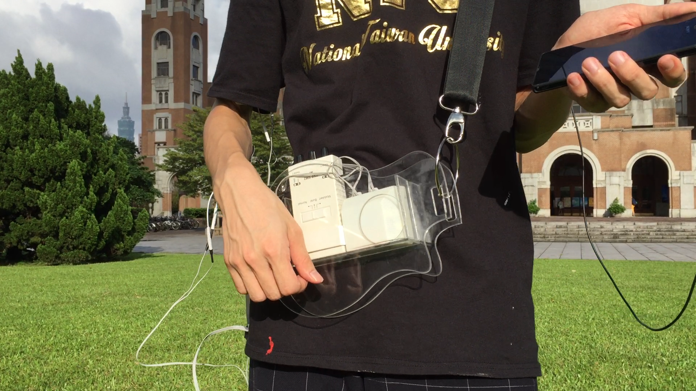
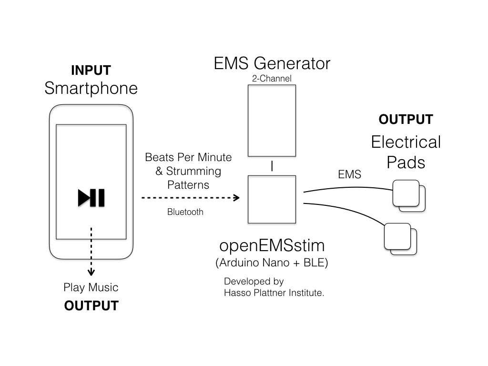
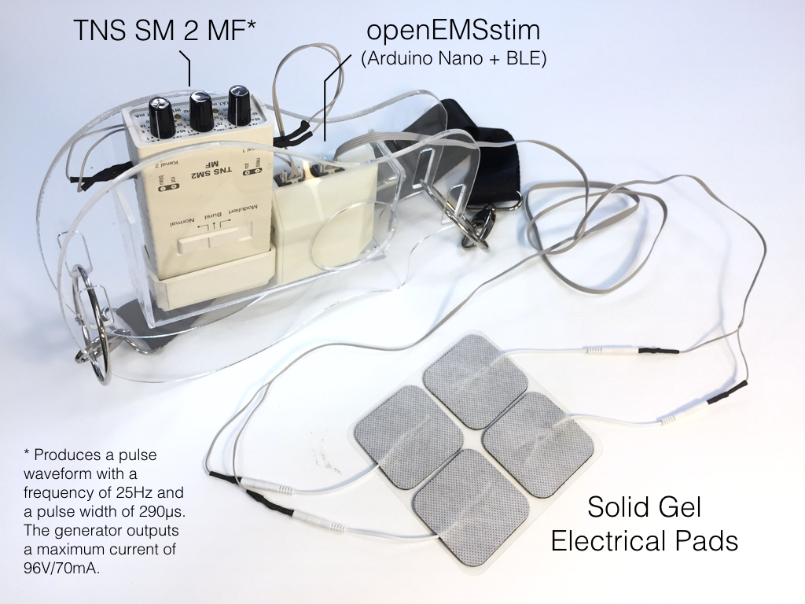
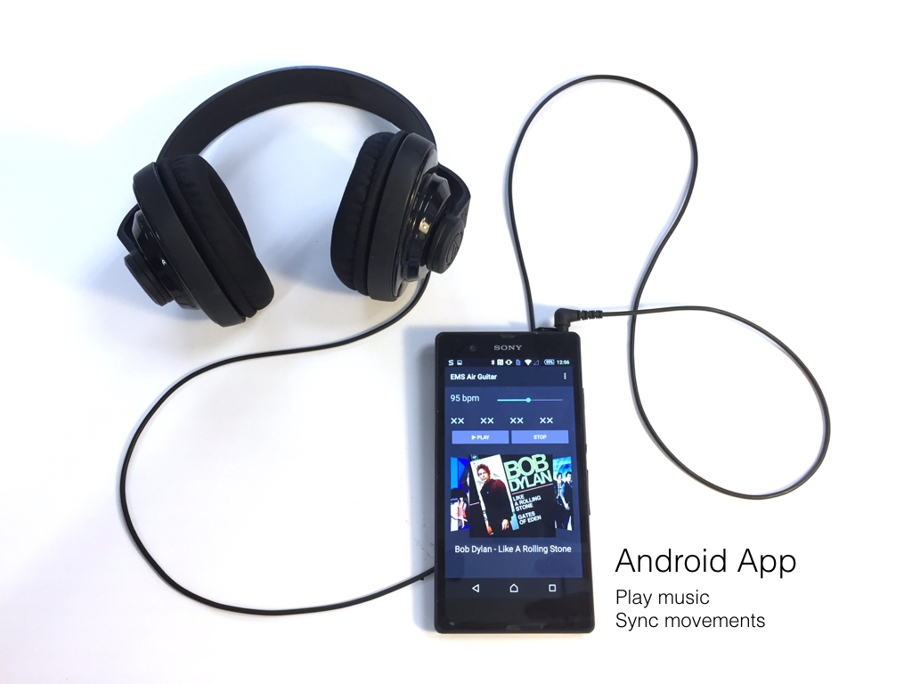

EMS Air Guitar
=====

*UIST 2016 Student Innovation Competition Team Robin Hood (National Taiwan University)*

Shan-Yuan Teng, Yung-Ta Lin, Yi-Chi Liao

Playing an air guitar is an enjoyable experience, in which performers express the music though their body. Though it seems to be easy at first, not everyone can play it well. An air guitarist needs to master several skills, such as body coordination, sense of groove, and imagination to deliver delightful performances.

This work proposes “EMS Air Guitar,” an air guitar assistant using EMS (Electrical Muscle Stimulation) which impulses user’s arm to generate the picking motion on the right time.  A player can choose a piece of music in our system and wear our prototype. Then, the music will be translated into pulses to the player’s arm and wrist automatically.

EMS is an effective tool to make the air guitar easier to learn and play. Furthermore, it can provide a novel and more immersive music experience.

## System

## Devices

