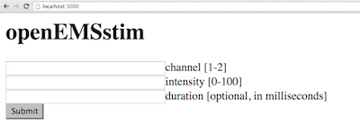

# openEMSstim through node.js

To interface through a web server we recommend creating a nodejs server (optionally you could do the same through python). In this repository you will find examples for creating a server with nodejs (client interacts through the webpage, and server sends commands to EMS machine) and also a nodejs script that directly controls the stimulator (without a web server).
 

## How to run the nodejs examples? 

1. Get nodejs 
2. install the dependencies by running the following command: ``npm install``. Alternatively it would be the same as installing these three packages below manually.
	1. ``npm install serialport`` (for USB communication)
	2. ``npm install express`` (for the web server side)
	3. ``npm install body-parser`` (for the web server side)
3. run your example on the command line by typing: ``nodejs nameofapp.js``
4. (if you are running a web server) open http://localhost:3000 on your browser. You will see:

### Additional contributors
* Fushimi Ryohei <fushimi.ryohei@gmail.com> (node.js fixes)

### License and Liability

Please refer to the liability waiver (in documentation/liability_waiver.md).

Please refer to the license (in /license.md)

