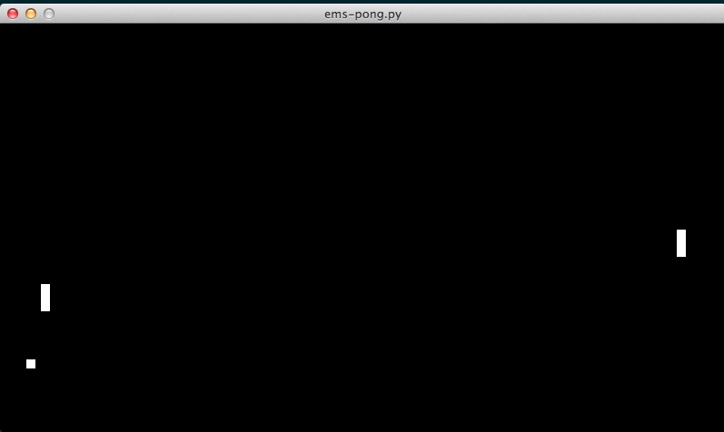

# using openEMSstim via python

This is a collection of python examples of how to interface with openEMSstim (via USB):

1. **pyEMS**: is the python module that you need to send commands to openEMSstim 
	1. **openEMSstim.py**: is the main module, allows to connect to the board
	2. **EMSCommand.py**: contains the function to generate EMS commands
2. **send_single_command.py**: is a simple script to send one command via USB to openEMSstim
3. pong-in-python: is an example of a simple game using EMS and Python
4. more-detailed-python-examples: has some extra things you might want to explore
5. tests: run ``python test_openems_module.py`` to check if your python module works
6. calibrate_openEMSstim.py: is a small script that helps you calibrate values for your prototypes. Note that the best way to interact wiuth it is by somply launching it, i.e., ``python calibrate_openEMSstim.py`` and follow the on screen commands.  
	
## How to run the python apps

1. Make sure you have python installed
2. Install our dependency by doing: ``pip install -r requirements.txt``
3. Make sure the app that you want to run is trying to connect to the correct serial port.
   1. edit the ``nameofapp.py`` file and find the line that defines and opens the EMS device, it should look like: ``ems_device = openEMSstim.openEMSstim(serial_port,19200)`` in this case, all you need to do is change the variable ``serial_port`` to your correct port (check on your operating system what is the port ID) for instance on Mac it might be something like ``serial_port = "/dev/tty.wchusbserial1410"``
4. Run an app by typing ``python nameofapp.py`` (do not forget to configure serial port)

## More info about pong-in-python game

The game is simple: every time a player looses a point (like in the image below, player left is about to loose a point) that player gets 2 seconds of EMS stimulation. 

In order to alter the game, change the parameters:

1. ``self.left_player_lost_stimulation = ems_command(1,100,2000)`` [line 73]
2. ``self.right_player_lost_stimulation = ems_command(2,100,2000)``[line 74]

Or found more interesting places of the game to trigger EMS commands, maybe to counter the players' input (if you hit the keys to move… EMS prevents you from doing so!).

### License and Liability

Please refer to the liability waiver (in documentation/liability_waiver.md).

Please refer to the license (in /license.md)

