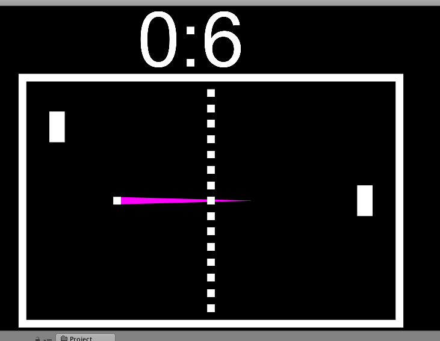
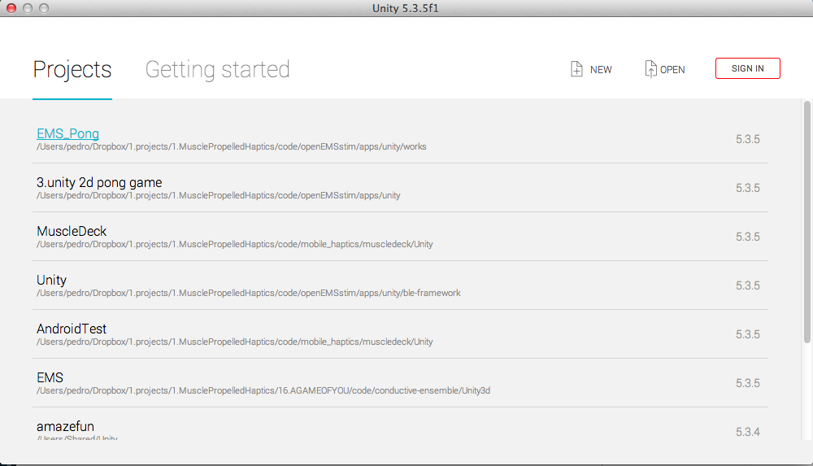
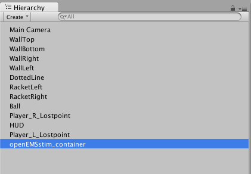
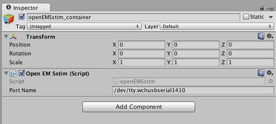
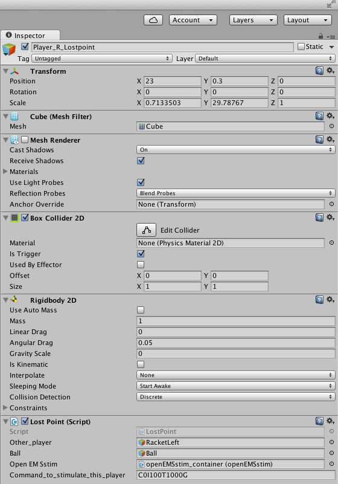
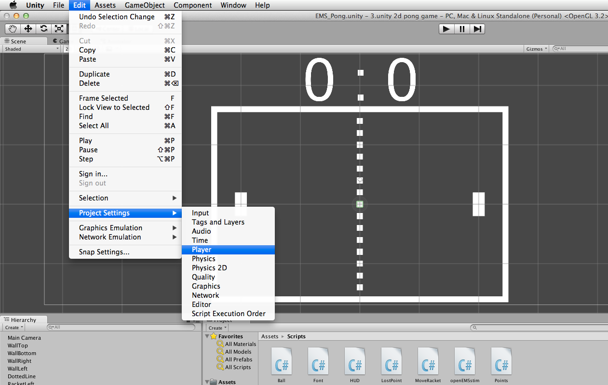
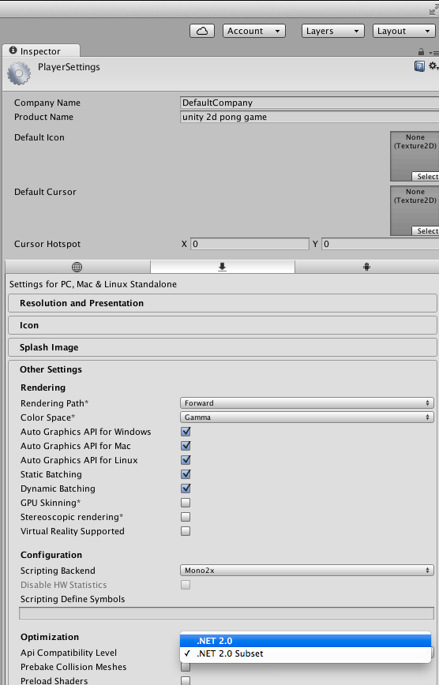

# using openEMSstim in Unity3D

This is a collection of Unity3D examples of how to interface with openEMSstim (via USB):

1. **EMS_Pong**: is a game of pong that is connected to the openEMSstim and stimulates the player who looses a point. It does so by interfacing with the openEMSstim board via USB using the Unity3D Serial capabilities.
	
## How to run the EMS_Pong Unity3D game 

The game is simple: every time a player looses a point (like in the image below, player left is about to loose a point) that player gets a few seconds of EMS stimulation. 

1. Make sure you have Unity3D installed
2. Import the whole project as a new project or open the EMS_Pong.unity (A scene file, located under the "Assets" folder).
3. Go to the GameObject "openEMSstim_container". 
4. Using the GUI inspector on the right side of the Unity Editor, make sure that you are providing the correct serial port.
5. check on your operating system what is the port ID. for instance on Mac it might be something like ``/dev/tty.wchusbserial1410``. Type that in unity. 
6. If you want to change the player's stimulation message, check the Player_R_Lostpoint (a game object) and the Player_L_Lostpoint (a game object). You can edit the raw EMS messages there.

Note: this require the **project to be set to .NET2.0 instead of .NET20.0(Subset)**.
1.
2. 

### License and Liability

Please refer to the liability waiver (in documentation/liability_waiver.md).

Please refer to the license (in /license.md)

