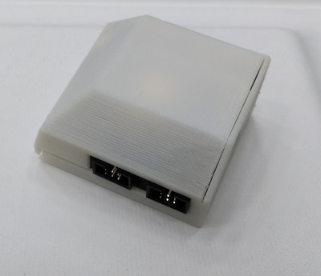
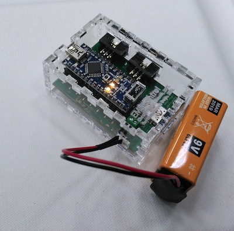

# Building a case for your EMS board
In this repo you have a files for:

1. a 3D printed case
2. a laser-cuttable box case (with finger-joints)

## 1. 3D printed version

This version is straightforward: simply print it and it all should fit as illustrated below.
This is the main version behind openEMSstim. 

## 2. laser cut box

Don't forget to test the finger-joints on your cutter first, since if you want these to click properly they might require adjustment. If not simply glue the box using acrylic or wood glue (based on your choice of material). The box will look similar to the one below.
This was the version Pedro Lopes & Max Pfeiffer used on World Haptics & CHI workshops. 

## make your own or remix it!
The files here are (just like the rest of this project) entirely open source, so feel free to remix and share with others what you have created. For instance: if your Arduino nano does not have a top programming header, you can cut the top of the case without the hole. Or if you use another battery with this board (refer to hardware modifications) you can resize the box to fit a smaller LiPo battery, etc. 

