# getting started: unpacking & what is what

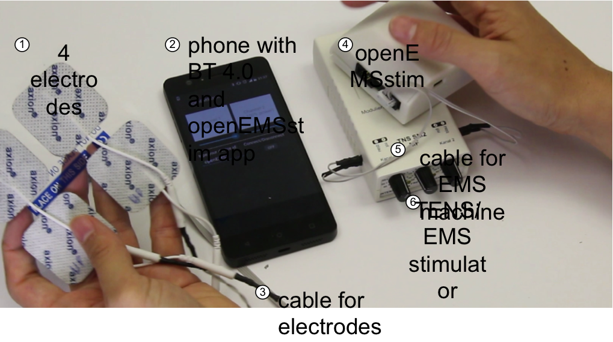

All the following steps are accomplished in our <a href="http://plopes.org/ems/#openEMSstim">video tutorial (complete tutorial)</a> as well. I recommend you to first read them through, familiarize yourself with the gear and watch the video later. Pause the video when needed and execute each step carefully, always checking the hardware as recommended and not skipping any step.

So what do we have here:

1. 4x pre-gelled EMS/TENS/FES electrodes 
2. 1x bluetooth 4.0 device for controlling the openEMSstim, a simple smartphone.
3. 1x cable to connect the openEMSstim to the electrodes
4. the openEMSstim (w/ 9V battery inside and an arduino Nano)
5. 1x cable from your EMS/TENS device to the openEMSstim
6. 1x 2-channel off-the-shelve muscle stimulator (TENS/EMS/FES)

## 1. Testing the EMS signal generator first!

The video for this section is this <a href="http://plopes.org/ems/#testingEMSmachine">here (testing an EMS signal generator)</a>. 

The first thing to do is make sure you are **familiar with your EMS device** (the signal generator). If you are not, there is no point in continuing further, in fact I strongly advise to experiment (slowly, carefully and safely) with your EMS device on its own for a few days. Here's how to use a EMS/TENS device:

**MAKE SURE THE EMS DEVICE IS OFF UNTIL WE SAY DIFFERENTLY.**

1. **if this is not a off-the-shelve medically compliant device. stop.**
2. Disconnect any cable that might be connected, that includes EMS<->electrodes cable, **disconnect any electrodes from your body** or anything else.
3. Insert battery in stimulator (typically 9V). 
4. Connect the electrode cable to it (sometimes one cable for all channels, usually one electrode cable per channel). This cable should have ends matching your electrode plugs. Connect it to the EMS device **but do not connect electrodes to it**.
5. Still with the EMS device off: Plug the electrodes to the cable ends.
6. **If you are not using pre-gelled EMS/TENS electrodes that are compatible with your device. stop.**
7. **Go read: SAFETY again.** This is really important as you do not want to incorrectly place electrodes and cause harm.
8. **Double check: is the EMS device off? It should be.** 
9. Place one PAIR of electrodes FROM THE SAME CHANNEL of the stimulator onto your skin. You do so by attaching each electrode to a position in the muscle. For starting I recommend the palm flexor in the right arm. 

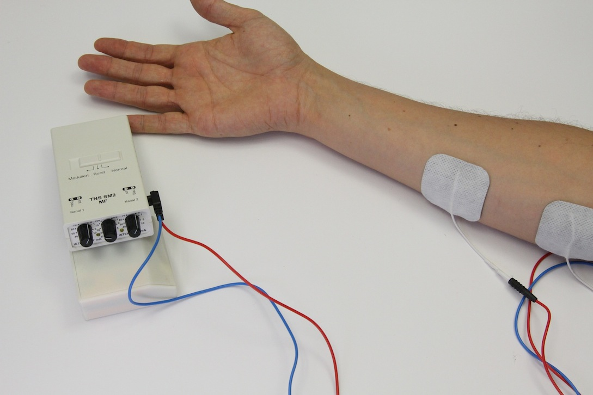

10.  **Turn all the dials in the EMS machine to their lowest intensity settings** (this includes: intensity dial, pulse-width dial and frequency dial). All these values can be later experimented with, but here's a suggested approach for testing EMS for the first time:
	1. Set the frequency around 70-100Hz. 
	2. Set the pulse with to around 200us (microseconds). Note that some machines don't have an adjustable pulse. which is the case of this one in the pictures. 
	3. Start increasing the amplitude very slowly from 0 to something around 6mA (if your device has no current meter, go even slower). 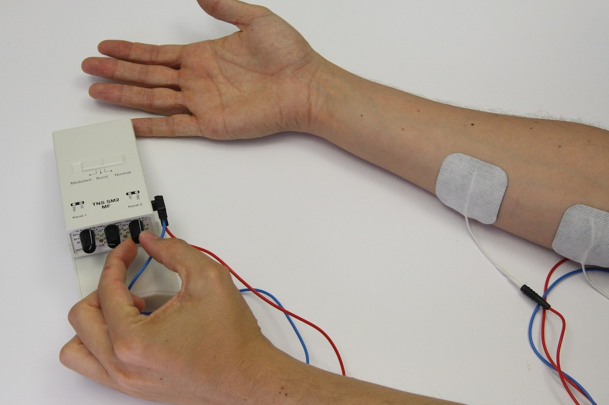	
	4. Depending on your machine you might feel a tingling sensation around such 5mA~6mA (or higher, depends on your placement and skin)
	5. You can stop at the tingling sensation and experience that for a moment. This is caused by the electricity passing by your skin receptors, triggering a particular kind of tactile sensation. 
	6. In order to produce an involuntary muscle contraction (actuation) you will have to increase the current, typically up to 10mA - 12mA (but this ranges from person to person due to skin conductivity, size of muscles, device, electrodes and more importantly correct electrode placement). This will cause a visible contraction on your palm (causing it to close). 
	7. Stay here for a while and experiment with it up and down (slowly and gently). 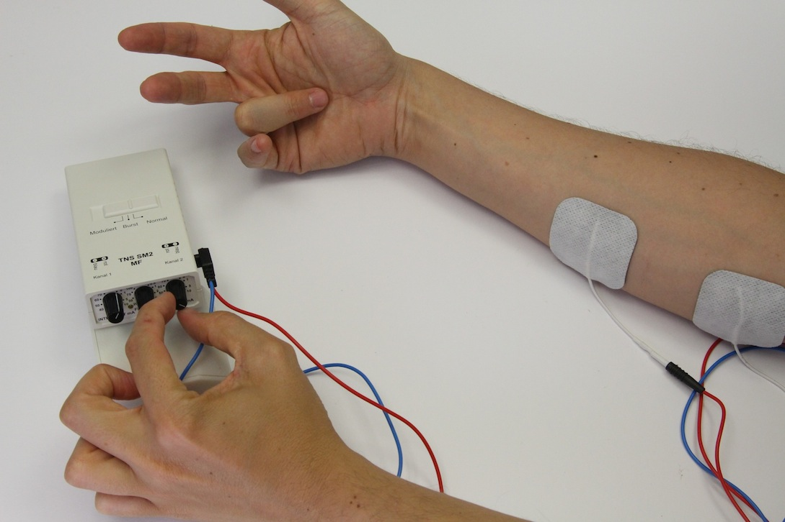
	8. **Do not experiment with frequency nor pulse-width setting yet.** To do that: read the section "Exploring EMS parameters" before.
	9. If you feel comfortable try to find a stronger contraction by, again, providing 1 or 2mA more in the intensity dial. 
11. Lower the intensity to zero, by turning the intensity dial all the way to zero.
12. **Then turn off the machine (electrodes are still on you). **
13. **Take the electrodes off. **

## 2. Powering the openEMSstim on

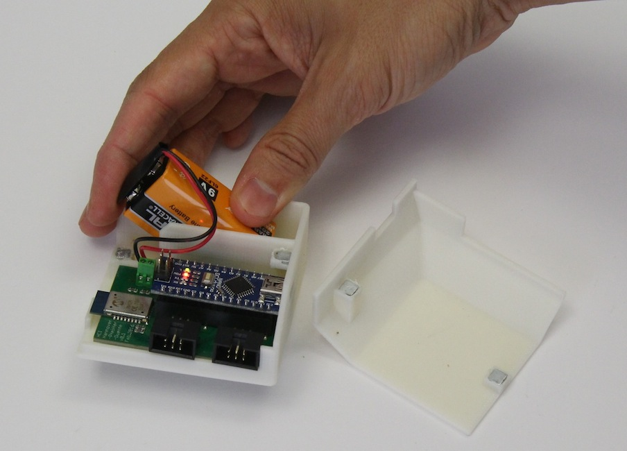

**Turn it on by safely connecting it to a 9V battery. ** Please check the polarity of the battery (+ and - are correctly inserted) of the battery before connecting. 

## 3. Connecting the EMS control module to an Android Device via Bluetooth 

P.s.: if you want to do this over serial, see below our section "1.4" of the "Resolving Potential Issues". 

In order to control your EMS device via openEMSstim you need to send commands via bluetooth (or serial, but here we prefer bluetooth over serial -- for serial examples go to [APIs](../apps/README.md)). **Here's the steps to connect to an Android phone using Bluetooth:**

**MAKE SURE EMS DEVICE IS OFF FOR THIS SECTION. YOU DON't NEED TO CONNECT ANY CABLES FOR NOW**

1. **If your phone does not have BT4.0 aka Bluetooth LE (Low Energy). Stop. **
2. Turn own your bluetooth (settings of the phone)
3. Check whether the bluetooth can see your EMS device. We suggest you use [BLEscanner](https://play.google.com/store/apps/details?id=com.macdom.ble.blescanner) app (free). It will show you the nearby Bluetooth LE devices and you can write down the name of the openEMSstim, it is probably something like openEMSstim01 (see here for my naming conventions). 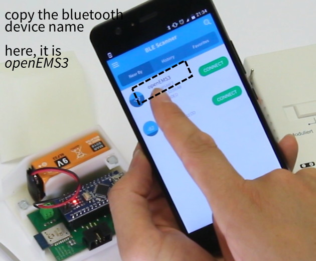
4. Open one of our EMS apps, I recommend: [openEMSstim-control.apk](../apps/android-apps/openEMSstim-control/apk) (install by tapping on it and Android will install it, you can even copy it via USB by downloading it <a href="http://plopes.org/ems/#getAndroidApp">here</a>)
5. Inside the "openEMSstim-control.apk" app:
	1. Check the "Device Id". 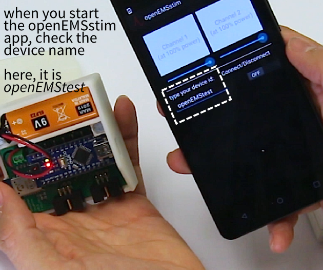
	2. Is it correct? If not, type the device name you saw on the bluetooth scanner.  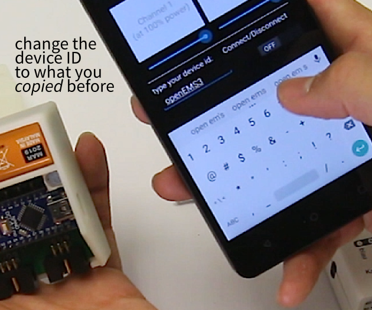
	4. Now tap "connect" (the ON/OFF switch).
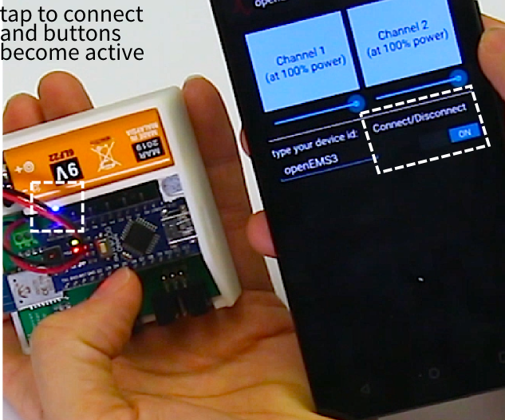
	5. The openEMSstim buttons will become active (turn from grey to light blue, and text becomes opaque) if it connected successfully. If not, simply reboot the app and try again (sometimes happens). Also, you can open your openEMSstim board and see if the blue LED inside is on (if bluetooth connection is established, the blue LED goes on).
6. The app and openEMSstim communicate properly. You can now test the channels independently:
	1. Tap and hold in the "channel 2" button on the app. You should see a "red" LED on the openEMSstim when you do that, also the color of the button matches the LED color.  
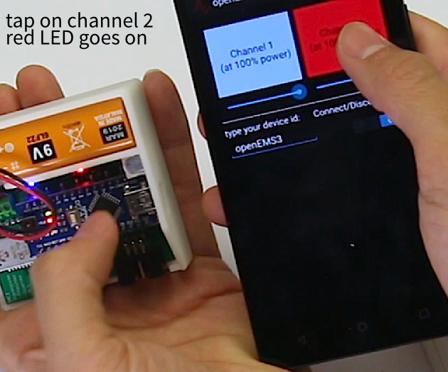	2. Tap and hold in the "channel 1" button on the app. You should see a "green" LED on the openEMSstim when you do that, also the color of the button matches the LED color.
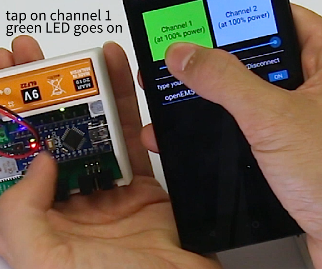	3. All is fine. 	 

## 4. Setting all levels to low, before any test

1. Look at your EMS device: is the intensity dial on low (zero/off)? Make sure it is.
2. Look at the **openEMSstim-control** Android App: is it connected and the sliders are on maximum? Check the slider values and make sure they are at 100%:
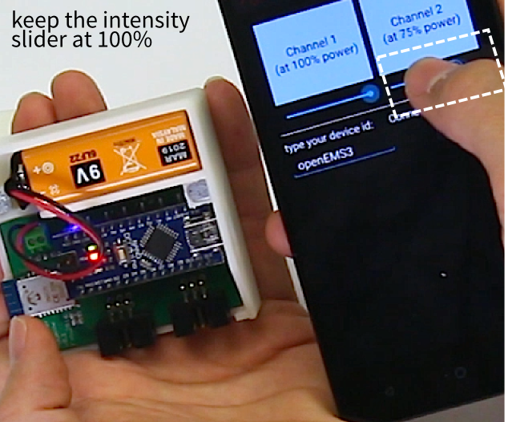

## 5. Plugging the EMS signal generator (TENS/EMS) to the board/module

This is simple but make sure you plug into everything into its own socket, not the other way around:
1. first plug the EMS machine to the right most socket (**side of the USB connection**), like this:

2. second plug the electrodes to the left most socket (**side of bluetooth chip**), like this:
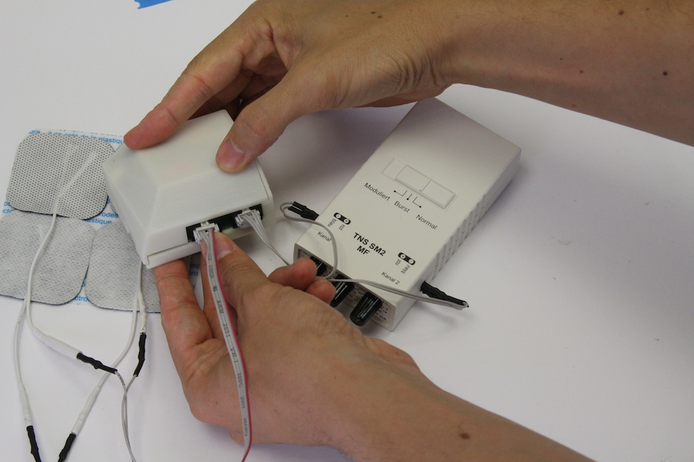

## 6. Attaching electrodes to the muscles.

Let's use the same muscle as before, since you are now familiar with the EMS sensations on that spot. Again place two electrodes on the palm flexor. 

 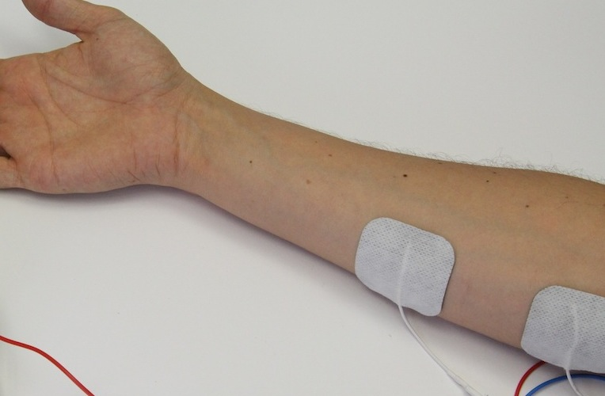

## 7. Check time: this is how it should look like at this point.

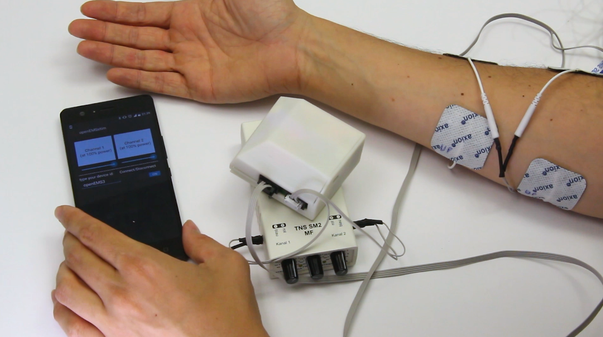

## 8. Test and iteratively calibrate yourself, step by step.

1. Start your EMS machine at minimum intensity. Open one of the channels. 
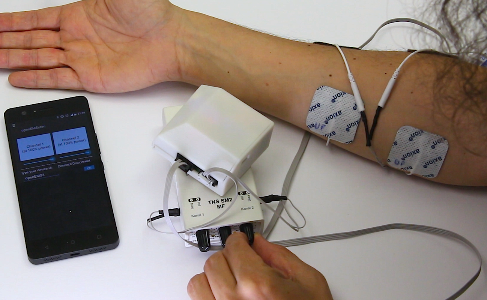
2. Using your phone open the channel corresponding to the channel you opened (if you don't know which one is which, open both until you find out which one it is, and then right that down)
3. When you open the channel you won't feel anything, because the EMS is on minimum.
4. Increase the EMS **slightly**, by twisting the knob as little as possible (really small increments is the best way for now). 
5. Open the EMS channel using the phone app. Do you feel it now?
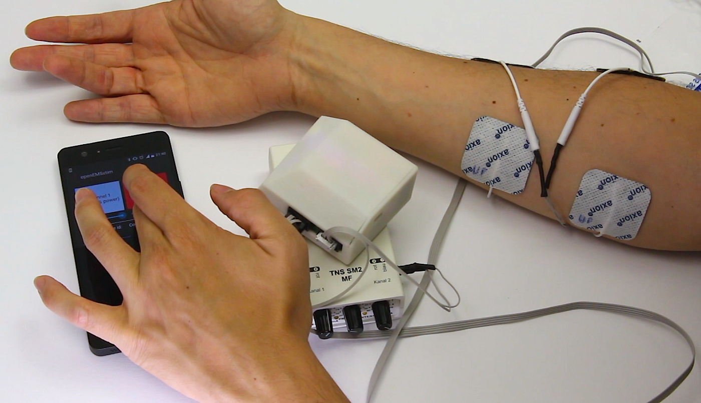
6. Loop steps 4-5 until you feel this. 

# Resolving potential issues

Before exploring any potential solution to your problem: **TURN THE MACHINE OFF AND TAKE THE ELECTRODES OUT OF YOUR SKIN**. Now we can start debugging. 

## 1. I don't feel any EMS impulses…

Okay, take it easy. This can be cause by multiple setting in the signal path. So let's break it down into sub-questions:

### 1.1 The EMS device is off.

Make sure the EMS device is on -- i.e., the signal generator that sends the impulses, a TENS machine, or a massage device. Most devices have a LED that shows you that pulses are coming out (they blink for each pulse, make sure to check that).

Important: some EMS devices (mostly the digital ones) shut off if the electrodes are not connected or if they detect a broken signal path (they are trying to help you, and protect the patient, so never circumvent these protections). If this is happening it can be due to: 

1. openEMSstim board is off (so signal path is broken) 
2. the openEMSstim is on but the channels are closed and our EMS machine won't allow for operation, the safest is to select another EMS machine that continuously send pulses.  

### 1.2. The openEMSstim board is off.

**Turn it on by safely connecting it to a 9V battery. **Please (triple) check the polarity of the battery before connecting. The modded boards have a safety diode to prevent inverse polarity but the awesome original design by Max and Tim does not and might break on inverted polarity.

If the board does not power after the 9V battery has been correctly inserted:

1. **Is the Arduino in there?** openEMSstim uses a Arduino nano on top, please insert the Arduino correctly onto the vertical (black) pin headers. To insert the Arduino correctly, check the pictures above, note that the USB port should face to the other side, opposite of the 9V connector (green header that goes to the battery). 
2. Is the 9V connector properly screwed to the board? Double check the power header with a simple screwdriver (and without the battery connected). 

### 1.3. The LEDs of the openEMSstim do not light up when I send bluetooth messages.

1. Check if the board is powered. 
2. Is the bluetooth connection correctly established? (blue LED is on?)
3. Are you sending the right messages (are you using the pre-built android app without any changes?)

### 1.4. I'm not using the bluetooth LE / 4 (or I don't have a phone) or I want to use USB instead!  

No worries, openEMSstim can be used via USB from any programming language or program that can send Serial messages. Check our tutorials on:

1. [sending via USB from Unity3D](../apps/unity/README.md)
2. [sending via USB from Node.js](../apps/node.js/README.md)
3. [sending via USB from Processing](../apps/processing/README.md) (note that some of processing Apps are bluetooth)
4. [sending via USB from python](../apps/python/README.md)

### 1.5. The bluetooth app does not see the openEMSstim board. 

The best way to debug this is stage by stage:

1. do you have a phone with BT 4.0 / BLE? (or a device like a laptop equipped with bluetooth version 4 aka the Bluetooth Low Energy?)2. 
2. Is the bluetooth on? (settings: enable bluetooth)
3. open a app that monitors the bluetooth connections on your device (for instance for android I recommend: BLE scanner). Does the device show up there?
4. Try to use the BLE scanner app to connect to the device. Does it connect (blue light of the openEMSstim goes on?)
5. If all above is true, you simply need to "restart" the EMS control apps, maybe they are buggy or got stuck. On an android you need to "close the app" to restart it", do not simply tap the home button (just suspends the app). Press the task switcher and swipe the app to close it. 

### 1.5. app buttons never react nor connects to the board (with a recent Android >6.0)

Another reason why this happens is because android has changed the API permissions a few times and the openEMSstim needs to access the bluetooth permissions. You can now (in new versions of Android) manually assign permissions as [shown here](http://www.howtogeek.com/230683/how-to-manage-app-permissions-on-android-6.0/). 

# 2. I cannot install any of the openEMSstim apps

**Did you grab the apk from this repo?**: Make sure you enable "install apps from any source" on your developer settings, which live under the settings of you android. Since our apps are not (yet) on the android store, they are not "signed" and hence available without this check. 

**Did you install it from android store (goole play store)?**: this could be caused by a version mismatch, currently the app works only on android >4.2 (which has the libraries that we use for accessing the bluetooth LE). If you've checked that you have such an android version and still have this issue, please write us a bug report via the repo / github issues report, or email us directly. 

**Did you build it from source?**: Double check you are generating the correct permissions! Android apps have a file called app manifest (https://developer.android.com/guide/topics/manifest/manifest-intro.html) in which the app reports to the operating system which permissions are required while running. Our app requires bluetooth so that permission must be present in that file. 

## 3. The openEMSstim responds to bluetooth and EMS/TENS is sending signals but I don't feel anything.

This is the most sensitive case, make sure you are sending small impulses to not harm yourself. Check the following:

1. Are you connected to the board by attaching a pair of medically compliant EMS electrodes to your skin on a muscle (e.g., palm flexor of the right arm)?
2. The EMS setting might be too low. First, power all off and disconnect everything from the openEMSstim. The connect the electrodes directly to the EMS machine, test it using the protocol described above (on step "## 1. Testing the EMS signal generator first!"). Write down the value that you felt clearly on a piece of paper close to you. Now re-wire the openEMSstim and check if you can feel that same setting, you can optionally try a bit stronger (just a bit) since there is some power loss in the circuit, do not exceeded it too much. Feel it now?
3. The board you manufactured might be faulty. Disconnect and ask for help before trying anything further. 

### License and Liability

Please refer to the liability waiver (in documentation/liability_waiver.md).

Please refer to the license (in /license.md)

