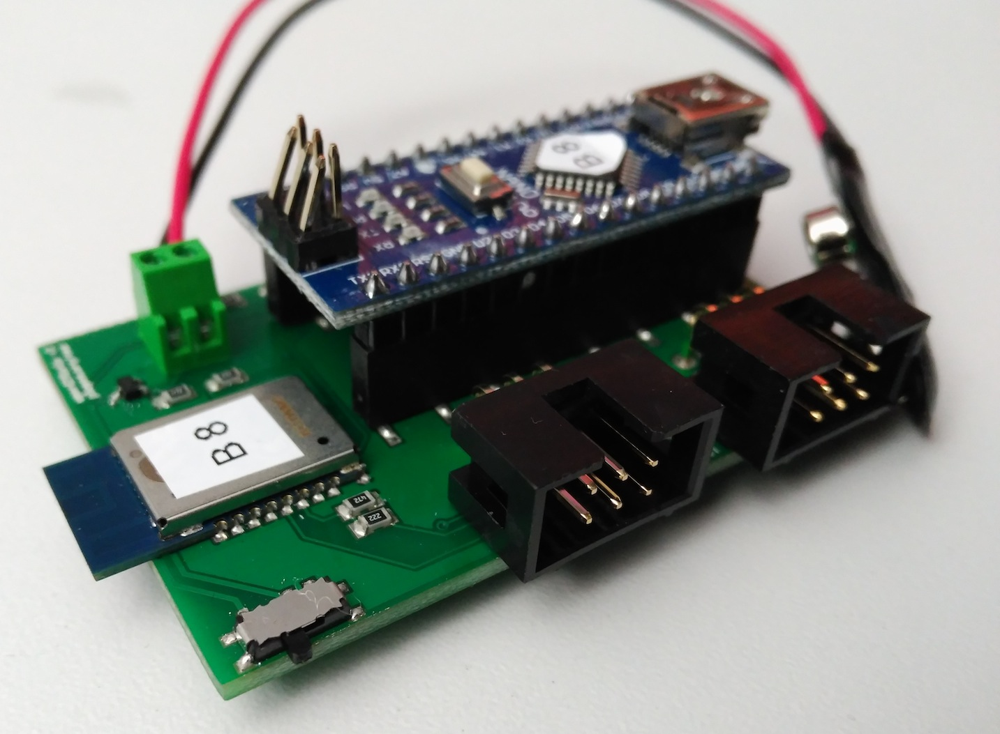

# Make your own board
The authors of the original (and awesome) board (Max Pfeiffer and Tim Dünte) have prepared a very comprehensible tutorial on how to use the Eagle files to make your own board.

Please refer to their tutorial:
https://bitbucket.org/MaxPfeiffer/letyourbodymove/wiki/Home/ToolKitHardware

## Part list
Please refer to here: https://bitbucket.org/MaxPfeiffer/letyourbodymove/wiki/Home/PartList
For the openEMSstim version add a 1N4001-like SMD diode (in SMB size) such as one of the ones below: 

- http://www.digikey.com/product-detail/en/diodes-incorporated/S1BB-13-F/S1BB-FDICT-ND/815933 
- http://www.mouser.de/ProductDetail/Diodes-Incorporated/S1BB-13-F/?qs=4%2fHtbAejkbNHxvTlC8Melg%3d%3d

## Notes on making a openEMSstim:
Currently the openEMSstim differs only slightly from the original board. 

We added two very useful features: (1) a diode to protect the board in case you accidentally reserve the battery polarity (believe us: it happens!) and (2) a switch for on/off. We are in the process of stabilizing a few more changes, see below. 

## Preview of upcoming versions:
In the upcoming versions we altered a bit more, here's a preview of what's coming up: 

1. Added a rechargeable lipo battery instead of a 9V block (tested, just needs integration)
2. Integrated 8 channel Multiplexer. (tested , just needs to be integrated)
3. Altered the input and output connectors (in progress)
4. Added a 5V voltage regulator instead of using the built-in from the Arduino.  (not tested)
5. No entire Arduino (not tested yet, smaller package)

Note that this is an open source project, so feel free to send pull requests with your features, mods, etc! If any of the upcoming features is important of you, write us and we will do our best to speed this up. 

### License and Liability

Please refer to the liability waiver (in documentation/liability_waiver.md).

Please refer to the license (in /license.md)
