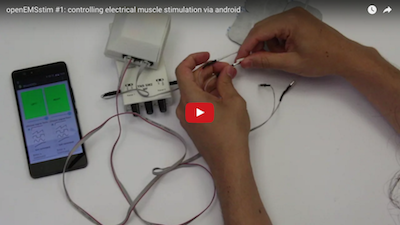
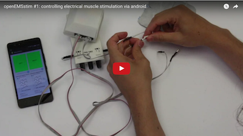

# tutorials and guides

Here's the summary of all our material on EMS and using openEMSstim board. You can find these information also [here](http://plopes.org/ems).

## 1. video tutorials

Click [here to watch this tutorial](https://www.youtube.com/watch?v=XgJF1DVwt7s) on how to step the openEMSstim via Android.

Click [here to watch this tutorial](https://www.youtube.com/watch?v=6VHgRX0lVJs) on the basics of EMS. 

## 2. step-by-step illustrated walkthrough

1. [Setting up the openEMSstim using Android](1.getting_started_step_by_step.md)

## 3. Learn more about a particular topic

1. [Safely using EMS](0.WhatNotToDo.md), a checklist of the **golden rules of EMS** 
2. [Choosing an Off the shelf TENS/EMS device](2.choosing_a_TENS_device.md)
3. [Protocol and control messages](3.software_guide.md)
4. [Exploring EMS parameters](4.exploring_ems_settings_and_parameters.md)
5. [Making your own board](5.make-your-own-board.md)
6. [Interfacing with Python](../apps/python/README.md) (via USB, with video [here](https://www.youtube.com/watch?v=Lq9wjp5K8wc))
7. [Interfacing with node.js](../apps/node.js/README.md) (USB)
8. [Interfacing with Processing](../apps/processing/README.md) (bluetooth 4.0 on android and USB)
9. [Interfacing with Unity3D](../apps/unity/README.md) (USB)
10. [Interfacing with Android apps](../apps/android/README.md) (via bluetooth 4.0)

### License and Liability

Please refer to the liability waiver (in documentation/liability_waiver.md).

Please refer to the license (in /license.md)

